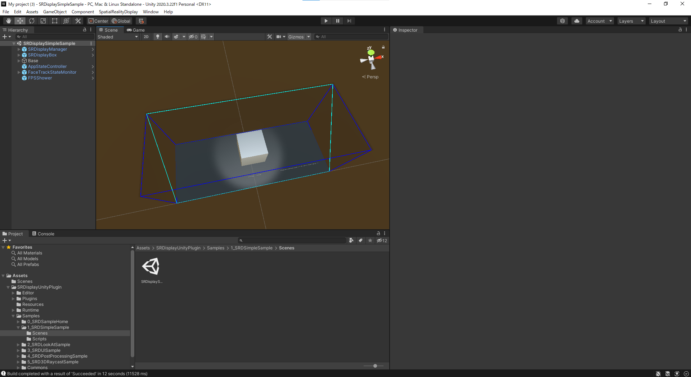
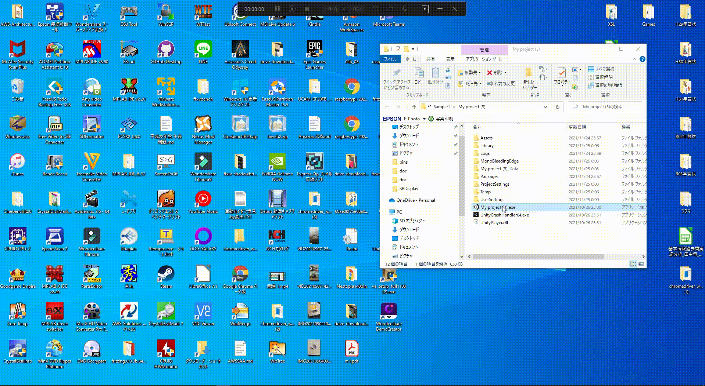
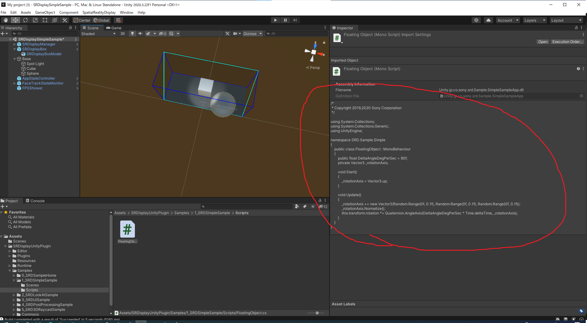
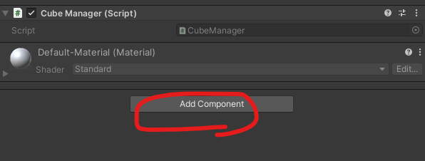
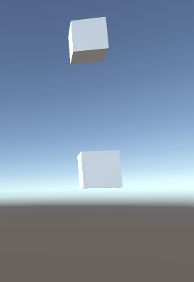

# 空間ディスプレイ（Spatial Reality Display）

## SR Display Sample
公式サイトの[「クイックスタート」](https://www.sony.net/Products/Developer-Spatial-Reality-display/jp/develop/Unity/Quickstart.html)を参考に実践しました



これをビルドすると・・↓ のように表示されます。



ボックスに球体（Sphere）を追加してみました。


↓ こうなりました。


置いてあるだけで動きませんね…  

どうも、この箇所でアニメーション制御しているっぽいね。



## ワンポイント
- SR Displayの実機がない場合は、以下の設定を行うこと。
  - Unityのメニューバーで、Edit > Project Settings を選択 
  - 「Spatial Reality Display」を選択
  - 「Run Without SR Display」をチェックする

- 以下のエラーが出る場合の対処法
  -「You should import Post Processing package from Package Manager if you want to use SRDPostProcessingSample」  
    - Unityのメニューバーで Window > Package Manager を選択
    - 左上「Packages:In Project▼」を「Unity Registry」に変更
    - 一覧の「▼ Post Processing」を選択して、右下「Install」をクリックする

## キー入力操作
``` C#
if (Input.GetKeyDown(KeyCode.Space)){
  …
} 
```

## オブジェクトの状態変化
``` C#
// Updateイベントは0.02秒ごとに呼ばれるイベント
void Update(){

  // 位置を X軸に 0.1f　ずつ動かす
  transform.position += new Vector3(0.1f ,0 ,0);

  // 以下は同じ挙動(位置をずらす)
  transform.Translate(new Vector3(0.1f ,0 ,0));

  // 回転させる
  transform.Rotate(new Vector3(0.1f ,0 ,0));

}
```

## RigitBody（物理演算）のコンポーネント

以下の演算をオブジェクトに付与するもの
- 重力
- 速度
- 加速度
- 力
- 移動量の制御
- 摩擦/慣性  

オブジェクトを選択して、「Add Component」を押して、コンポーネントを追加



3Dオブジェクトであれば、RigitBody(2DならRigitBody2D)を追加


これにより、オブジェクトに物理演算が付与されますが、デフォルトで「Use Gravity」（重力）が付与されるので、RigitBody追加後に実行するだけで単純に落ちていきます。  
さらに、その下にオブジェクトがあると、以下のとおりとなります。



演算計算処理などはまったく入れていませんが、設定だけでこのような動きとなります。面白いですね。
